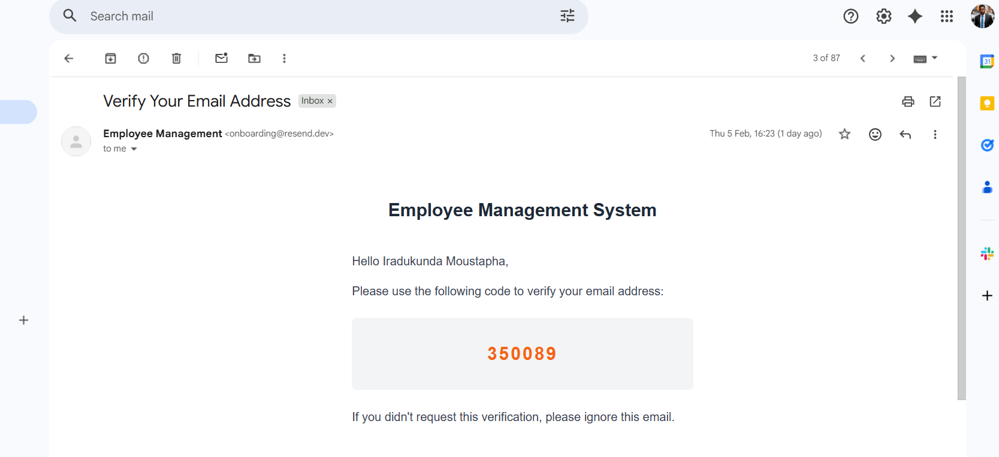
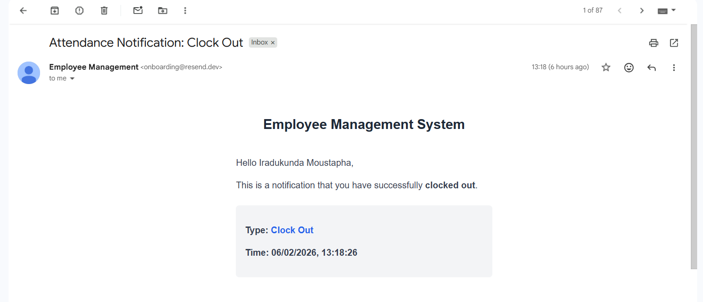
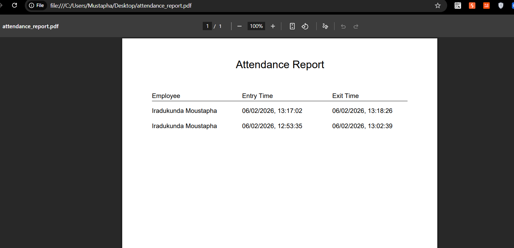

# Employee Management API

## Description

A comprehensive Employee Management System API built with NestJS. This application handles employee authentication, attendance tracking with real-time email notifications, and detailed reporting (PDF & Excel).

## Features

### 1. Authentication & User Management
- **Secure Signup/Login**: JWT-based authentication.
- **Email Verification**: Users must verify their email via OTP before accessing the system.
- **Password Management**: Secure password reset flow via email.
- **Role-Based Access**: Support for Admin and Employee roles.


*Above: Examples of 'Verify Your Email' and Welcome emails.*

### 2. Attendance Tracking
- **Clock In / Clock Out**: Employees can easily record their work hours.
- **Resilient Queue System**: Uses Redis and Bull queues to handle email notifications asynchronously.
  - **Fault Tolerance**: The system prioritizes recording attendance even if the email service is temporarily slow.
- **Instant Notifications**: Employees receive email confirmations for every Clock In and Clock Out action.


*Above: 'Clock In' and 'Clock Out' notification emails.*

### 3. Reporting
- **PDF Reports**: Formatted attendance reports ready for printing.
- **Excel Exports**: Data export for further analysis.
- **Date Filtering**: Filter reports by specific date ranges to see daily or monthly activity.


*Above: Generated PDF and Excel attendance reports.*

---

## Prerequisites

Before running the project, ensure you have the following installed:

- **Node.js** (v18 or higher)
- **pnpm** (recommended) or npm
- **Docker & Docker Compose** (for Redis)
- **MySQL** (Local or Remote)

---

## Installation & Setup

### 1. Clone the Repository
```bash
git clone https://github.com/iradukun/employee-management.git
cd employee-management-api
```

### 2. Install Dependencies
```bash
pnpm install
```

### 3. Environment Configuration
Create a `.env` file in the root directory:
```env
# Database
DB_HOST=localhost
DB_PORT=3306
DB_USERNAME=root
DB_PASSWORD=your_password
DB_NAME=employee_management

# Redis (for Queues)
REDIS_HOST=localhost
REDIS_PORT=6379

# Application
PORT=8030
SECRET_KEY=your_secret_jwt_key
APP_URL=http://localhost:8030

# Email Service (Resend)
RESEND_API_KEY=re_123456789 # Use your actual key
```

### 4. Start Infrastructure (Redis)
We use Docker to run Redis easily.
```bash
docker-compose up -d
```

### 5. Initialize Database
Run the setup script to create tables and seed initial data.
```bash
pnpm run setup
```
*Alternatively:*
```bash
pnpm run db:init
pnpm run db:seed
```

---

## Running the Application

### Development Mode
```bash
pnpm run start:dev
```
The server will start at **`http://localhost:8030`**.

### Production Mode
```bash
pnpm run build
pnpm run start:prod
```

---

## API Documentation

Swagger UI is available for interactive API exploration.
- **URL**: [http://localhost:8030/api-docs](http://localhost:8030/api-docs)

---

## Testing

The project includes comprehensive Unit and End-to-End (E2E) tests.

### Run Unit Tests
```bash
pnpm test
```

### Run E2E Tests
```bash
pnpm run test:e2e
```

### Test Coverage
```bash
pnpm run test:cov
```
